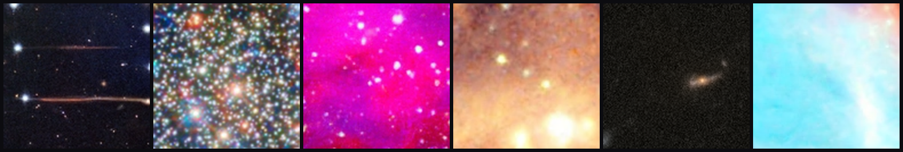
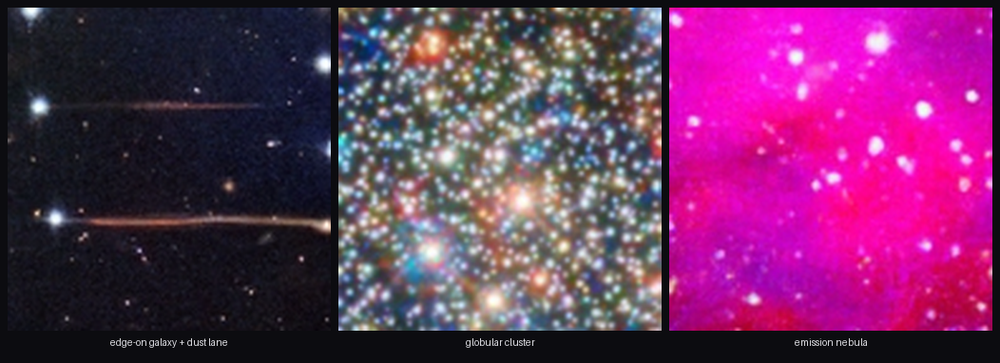
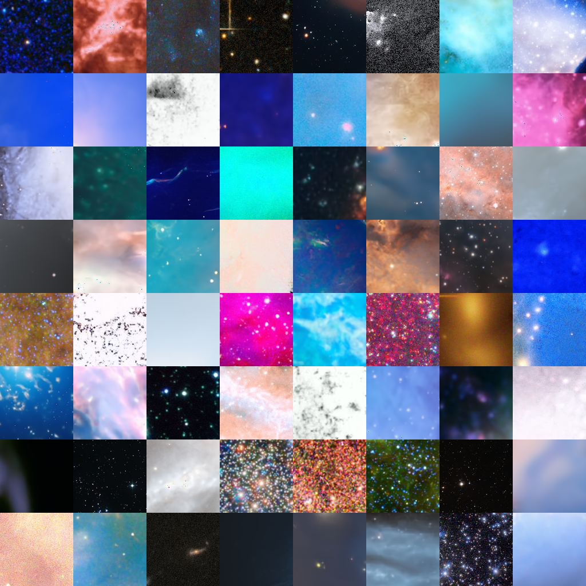
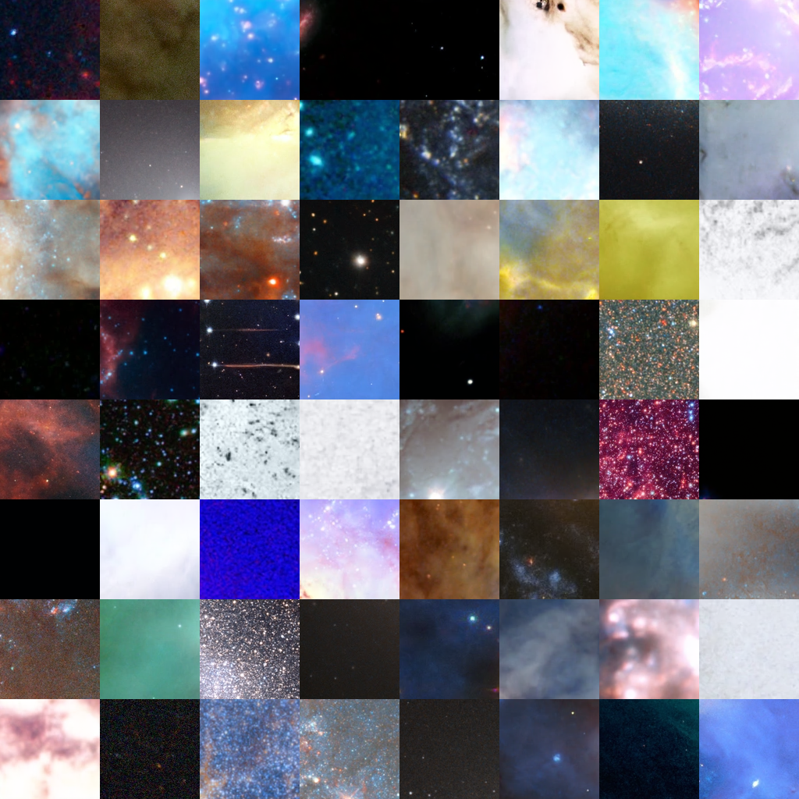

# deepsky

A from-scratch denoising diffusion model (DDPM) that generates deep-sky
astronomical images — nebulae, galaxies, star clusters — trained on public
imagery from ESA/Hubble, ESA/Webb, ESO, and NASA.

**▶ [Try it live](https://huggingface.co/spaces/jessholbrook/deepsky)** ·
[Model weights](https://huggingface.co/jessholbrook/deepsky-128px)



*Uncurated 128 px samples from the trained model. Every pixel is generated — no
retrieval, no post-processing.*

Everything is hand-written PyTorch — the U-Net, the noise schedules, the forward
process, the training loop, and both samplers. **No `diffusers` dependency.** The
goal was to understand diffusion by building it, then take it all the way to a
real trained model on real data.

---

## Results

Trained at 128 px for 200,000 steps on ~160k curated images (single RTX 4090,
~22 h, ~$18). The model learns genuine astronomical structure on its own:



Beyond broad "space-like" texture, specific phenomena emerge — **point stars
sharpen into crisp cores, dust lanes cut across edge-on galaxies, globular
clusters resolve into thousands of colored points, and bright stars even grow
the four-pointed diffraction spikes** characteristic of Hubble's optics (learned
purely from the data, never hard-coded).

<table>
<tr>
<td><br><sub><b>DDIM</b> (100 steps) — the grid rendered during training</sub></td>
<td><br><sub><b>DDPM</b> (1000 steps) — ancestral sampling, slightly cleaner</sub></td>
</tr>
</table>

These are **random, uncurated** 8×8 grids — the honest output distribution, not a
hand-picked best-of. Most tiles are keepers; a few are flat or noisy, as expected
at this scale.

### Download the model

The trained weights (1.4 GB) live on the Hugging Face Hub:
[**jessholbrook/deepsky-128px**](https://huggingface.co/jessholbrook/deepsky-128px).

```bash
uv run --with huggingface_hub hf download jessholbrook/deepsky-128px \
    ckpt_0200000.pt --local-dir runs/cloud128
uv run python scripts/sample.py --config configs/cloud-128px-full.yaml \
    --ckpt runs/cloud128/ckpt_0200000.pt --n 64 --sampler ddpm --out space.png
```

---

## How it works

A DDPM learns to reverse a gradual noising process. During training, a clean
image `x₀` is noised to a random timestep `t` and a U-Net learns to predict the
noise that was added; at generation time you start from pure noise and denoise
step by step.

### Diffusion math (`src/deepsky/diffusion/`)

- **Schedule** — Nichol & Dhariwal **cosine** ᾱ schedule, 1000 timesteps, all
  derived quantities (posterior mean/variance coefficients) precomputed in
  float64 for accuracy. `schedule.py`
- **Forward / loss** — `x_t = √ᾱ_t·x₀ + √(1−ᾱ_t)·ε`, trained with simple
  **ε-prediction MSE** at uniformly sampled `t`. `gaussian.py`
- **Samplers** — **DDPM** ancestral sampling (stochastic, all 1000 steps) and
  **DDIM** (deterministic, `η=0`, arbitrary step count). DDIM also supports
  resuming from a partially-noised latent for SDEdit-style editing. `samplers.py`

### The U-Net (`src/deepsky/models/unet.py`)

A standard ADM-style architecture, ~**87M parameters** at 128 px:

- Down/up paths with **residual blocks** (GroupNorm → SiLU → conv, with the
  timestep embedding injected per block) and **skip connections**.
- **Self-attention** at the 16×16 and 8×8 resolutions.
- **Sinusoidal timestep embeddings** through a small MLP.
- **Zero-initialized** output head and per-block final convs, so the network
  starts as a near-identity and trains stably.
- **Nearest-neighbor upsampling + conv** (avoids the checkerboard artifacts of
  transposed convolutions).

### Training loop (`src/deepsky/training/`)

Single-device (CUDA / MPS / CPU, auto-detected), infinite dataloader, **EMA** of
weights (0.9999), Adam, linear warmup + **cosine LR decay**, gradient clipping,
**atomic checkpoints**, and periodic DDIM sample grids. bf16 autocast on CUDA;
fp32 on MPS (its autocast is unreliable).

---

## The dataset

**159,462 curated 256 px crops (3.8 GB)** derived from public-domain and CC BY
imagery. Raw archive images are messy — full of annotated charts, spectra,
instrument diagrams, logos, and near-duplicates — so most of the work is
*curation*, in stages:

1. **Scrape** category/archive pages from each source.
2. **Blacklist** by title/description (charts, diagrams, artist impressions…).
3. **pHash dedup** — perceptual-hash near-duplicate removal.
4. **AVM image-type prune** — drop anything not tagged an *observation*.
5. **Brightness / spectra prune** — catch plot-like crops the metadata misses.
6. **CLIP zero-shot prune** — a final semantic pass against text prompts.

The result is verified visually to near-zero contamination. Crops are augmented
at train time with the full **dihedral group** (rotations + flips — all
physically valid for deep-sky images, a free 8× augmentation).

Per-crop credits are preserved in `data/crops256/manifest.csv`.

---

## Reproduce it

The project is built around a three-machine split (any one is optional):

| Machine | Role |
|---|---|
| Any machine (CPU) | data pipeline + fast tests |
| Mac mini (Apple Silicon) | overnight 64 px validation on MPS |
| Rented RTX 4090 | the real 128 px run (~$8–20) |

### Setup

```bash
uv sync
uv run pytest          # 23 fast tests, ~30s
```

### 1. Build the dataset (once, hours of downloading)

```bash
uv run python scripts/download_all.py                       # → data/raw/, resumable
uv run python scripts/build_dataset.py                      # dedup + 256px crops → data/crops256/
uv run python scripts/scrape_image_types.py                 # AVM Type per image (~45 min)
uv run python scripts/prune_non_observations.py --apply     # drop chart/simulation/collage crops
uv run python scripts/prune_bright_and_spectra.py --apply   # drop plot-like crops the type field misses
```

### 2. Validate on the Mac mini

```bash
# The gate: overfit a tiny model, then require the sampler to reconstruct it (~15 min).
# If this fails, stop — the stack has a bug and no long run is worth starting.
uv run pytest tests/test_overfit.py -m slow -s

# Overnight 64px run; time 200 steps, then size total_steps to fit the night.
uv run python scripts/train.py --config configs/mac-64px-validation.yaml
```

What a healthy 64 px run looks like (loss + `runs/mac64/samples_*.png` grids):

| Step | Expectation |
|---|---|
| init | loss ≈ 1.0 (zero-init output head predicts nothing) |
| 2k | loss ≈ 0.15; colored blobs with a space palette (blacks + nebula hues) |
| 10k | nebula-like textures, obviously "space" statistics |
| 30k | coherent structures: gas filaments, galaxy smudges, cluster densities |
| 75k | loss plateau ~0.03–0.06; some samples pass as real thumbnails |

**Point stars sharpen last** — smeared stars at 30k steps is normal, not failure.
Red flags: loss stuck > 0.1 at 10k, NaN, all-gray grids, EMA grids worse than raw.

### 3. The real run

Follow [cloud/README.md](cloud/README.md) for the full RunPod/Vast.ai runbook
(upload data, throughput gate, tmux, checkpoint sync, kill criteria). The trained
model here used `configs/cloud-128px-full.yaml`: 128 px, batch 32, cosine LR
1e-4 → 1e-5, EMA 0.9999, 200k steps. Resume from any checkpoint:

```bash
uv run python scripts/train.py --config configs/cloud-128px-full.yaml \
    --resume runs/cloud128/ckpt_0100000.pt
```

### 4. Generate

```bash
uv run python scripts/sample.py --config configs/cloud-128px-full.yaml \
    --ckpt runs/cloud128/ckpt_0200000.pt --n 64 --sampler ddpm --out space.png
```

`--sampler ddim --steps 50` is much faster (good on MPS/CPU); `ddpm` is slower
but a touch cleaner.

---

## Dataset attribution

Training data is derived from publicly released imagery:

- **ESA/Hubble** (esahubble.org) — CC BY 4.0
- **ESA/Webb** (esawebb.org) — CC BY 4.0
- **ESO** (eso.org) — CC BY 4.0
- **NASA Image and Video Library** (images.nasa.gov) — public domain

Per-image credits are preserved in `data/crops256/manifest.csv`. If you publish
samples or weights, retain this attribution list.
